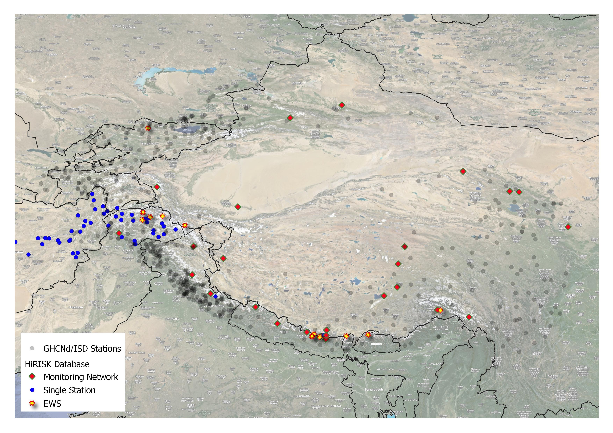
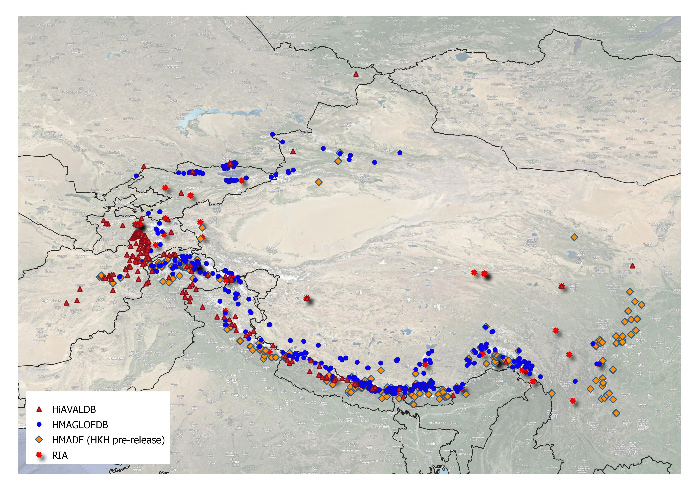

# HiRISKDashboards

Data visualized in hosted dashboards at https://hirisk.org/#Dashboards 

# HiRISK_Monitoring

Tabular overview on all monitoring setups in High Mountain Asia (to be updated), including data managers and data access. Also includes Early Warning infrastructure. 

# HiRISK_Hazards

Datasets on mountain hazards curated internally or pulled from external sources. GLOFs are taken from the HMAGLOF database (https://github.com/fidelsteiner/HMAGLOFDB), avalanches from HiAVAL (https://github.com/fidelsteiner/HiAVAL), debris flows are a prerelease for a forthcoming dataset and rock and ice avalanches are taken from Zhong et al. 2024 (https://zenodo.org/records/10458200).
